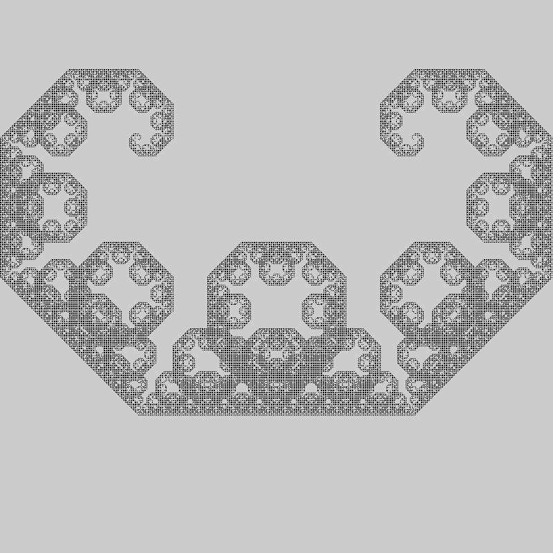
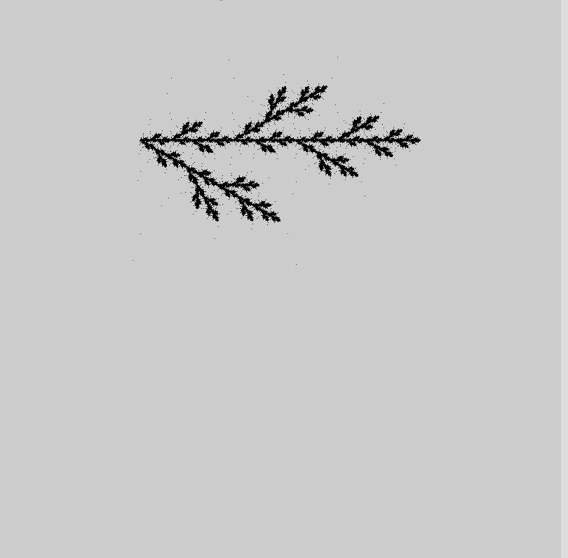
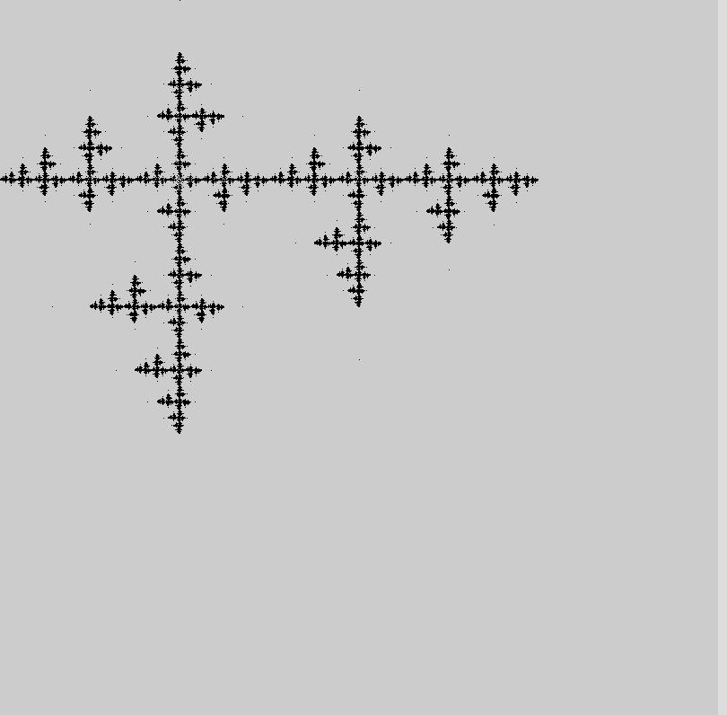
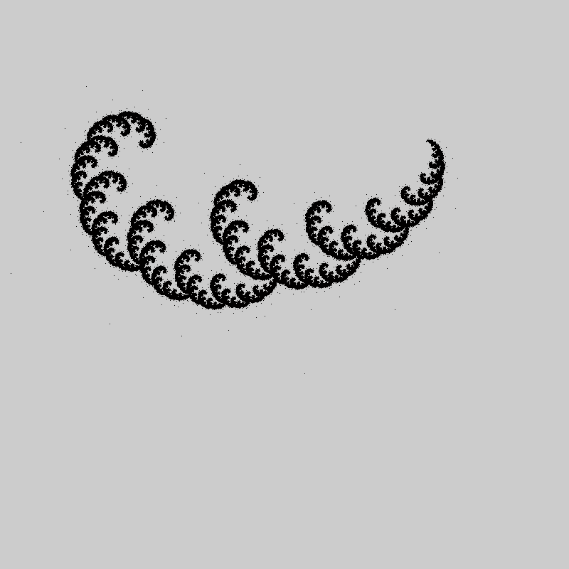

# fractal-quil

A Quil sketch designed to ... well, that part is up to you.

## Usage
1. install leiningen (https://leiningen.org/)
2. in your shell 
``` 
    ~$ mkdir Github $$ cd Github
    ~Github$ git clone https://github.com/MokkeMeguru/fractal-quil && cd fractal-quil
    ~Github/fractal-quil$ lein repl
    fractal-quil.core=> (-main)
    // or
    fractal-quil.core=> (change-parameter "a")
    fractal-quil.core=> (-main)
    fractal-quil.core=> exit
    Bye for now!
    ~Github/fractal-quil$ 
```
 * you can change parameter {"a","b","c","d"}
 1. "a"
 
 2. "b"
 
 3. "c"
 
 4. "b"
 
## License

Copyright © 2016 FIXME

Distributed under the Eclipse Public License either version 1.0 or (at
your option) any later version.
